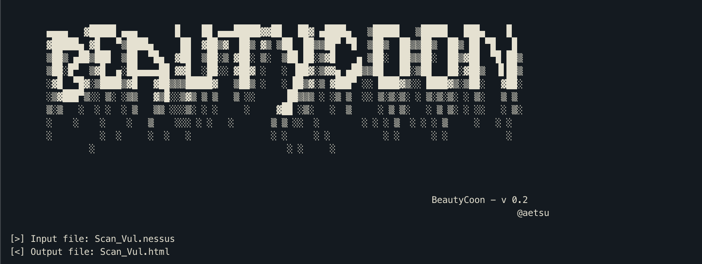
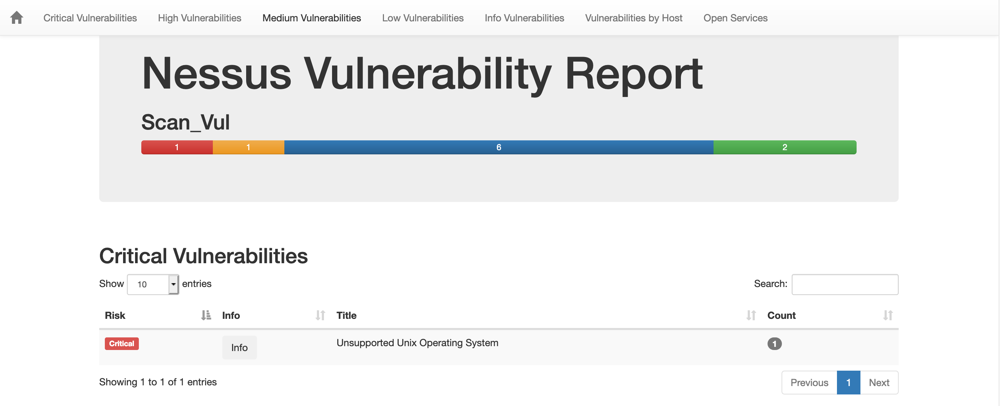
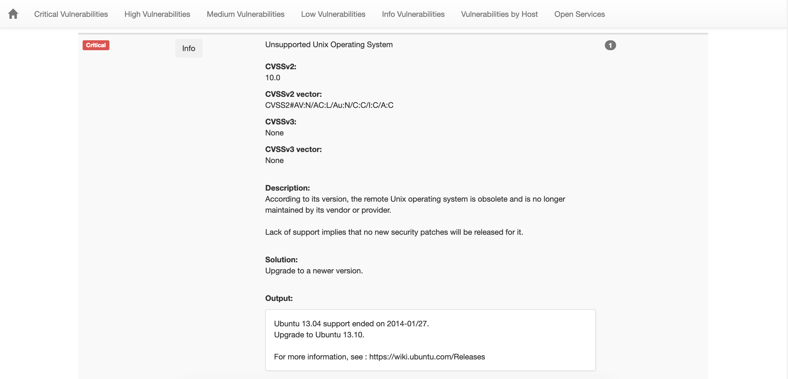
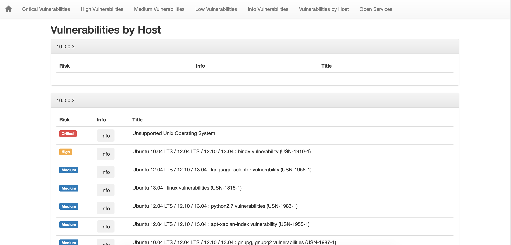

# BeautyCoon 
**Beautify Nessus scan output**

- Inspired by the work of [@honze_net](https://www.twitter.com/honze_net) with his [nmap-bootstrap-xsl](https://github.com/honze-net/nmap-bootstrap-xsl/)
- BeautyCoon uses a fork of [pynessus](https://code.google.com/archive/p/pynessus/) with Python3 support.


## Requirements
- python3.x

## Usage
```
python3 beautyCoon.py <file.nessus>
```
The output file will appear in the folder where the original *.nessus* file with the same name but *.html* extension.

* * *

## Examples
- As an example I used the .nessus file located in the [sdnips/ACNS_FinalProject_Code/Scan_Vul.nessus](http://gitlab.thothlab.org/ASU/sdnips/blob/master/ACNS_FinalProject_Code/Scan_Vul.nessus) repository:





* * *

## TODO
- [ ] Clean code...
- [ ] Burp support
- [ ] Nmap support
- [ ] OWASP Zap support
- [ ] Acunetix support
- [ ] Remove [pynessus](https://code.google.com/archive/p/pynessus/) dependence
